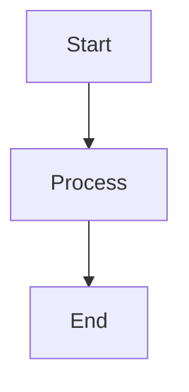

# AI-Agnostic Documentation Pattern

**Last Updated:** 2025-01-16  
**Category:** Patterns  
**Source:** AI-Native Spec-Driven Development Research

---

## Overview

**Critical Principle:**
> Specs must not depend on a specific AI editor

This pattern ensures that specifications can be consumed by any AI coding assistant, avoiding vendor lock-in and ensuring portability.

---

## Why AI-Agnostic?

### Problem with Tool-Specific Specs

- **Vendor Lock-In:** Tied to specific AI editor
- **Portability Issues:** Can't switch tools easily
- **Maintenance Burden:** Multiple formats to maintain
- **Limited Reusability:** Specs only work with one tool

### Benefits of AI-Agnostic Approach

- **Portability:** Works with any AI editor
- **Future-Proof:** Compatible with new tools
- **Reusability:** Same specs for multiple tools
- **Maintainability:** Single source of truth

---

## Recommended Structure

**Note:** This is a conceptual structure. The actual directory name can vary (`specs/`, `documentation/`, etc.). The key is the **concept**, not the specific directory name.

### Conceptual Structure

```
[specs-directory]/
├── vision.md              # WHY - Project vision and goals
├── requirements.md        # WHAT - Functional requirements
├── invariants.md          # MUST NEVER BREAK - System invariants
├── api.contract.yaml      # INPUT / OUTPUT / ERRORS - API contracts
├── workflows.mmd          # SYSTEM FLOWS - Process diagrams (Mermaid)
├── non-functional.md      # PERF / COST / SLA - Non-functional requirements
├── risks.md               # KNOWN FAILURE MODES - Risk documentation
└── glossary.md            # SEMANTIC LOCK - Domain terminology
```

**Key Concept:**
> This folder is the system's memory.

---

## Best Formats (AI-Agnostic)

### ✅ Recommended Formats

#### Markdown (.md)
- Human-readable
- Widely supported
- Easy to version control
- Works with all AI editors

**Example:**
```markdown
# Feature Specification

## Problem
What is being solved

## Expectation
What outputs are expected

## Constraints
Hard limits
```

#### YAML (.yaml, .yml)
- Structured data
- Machine-readable
- Easy to parse
- Works with all tools

**Example:**
```yaml
api:
  name: user-api
  version: 1.0.0
  endpoints:
    - path: /users
      method: GET
```

#### JSON Schema (.json)
- Standard format
- Validation support
- Tool-agnostic
- Widely supported

**Example:**
```json
{
  "type": "object",
  "properties": {
    "name": {
      "type": "string"
    }
  }
}
```

#### Mermaid Diagrams (.mmd)
- Visual documentation
- Text-based
- Version-controllable
- Tool-agnostic

**Example:**


---

## Avoid (Tool-Specific)

### ❌ Don't Use

#### Tool-Specific Magic Comments
```javascript
// @copilot: Generate function here
// @cursor: Use this pattern
// @claude: Follow this approach
```

**Problem:** Only works with specific tool

#### Prompt-Style Instructions Embedded in Code
```javascript
// TODO: AI assistant, please implement this function
// following the pattern from file X
```

**Problem:** Not structured, tool-dependent

#### Hidden Editor Metadata
```json
{
  ".cursor": {
    "rules": "..."
  }
}
```

**Problem:** Tool-specific configuration

#### Proprietary Formats
- Tool-specific file formats
- Binary formats
- Encrypted formats
- Custom schemas

**Problem:** Not portable

---

## Result

**All AI editors can consume the same specifications:**

- ✅ Kiro IDE
- ✅ Antigravity
- ✅ Cursor IDE
- ✅ Claude Code
- ✅ GitHub Copilot
- ✅ Future agents

---

## Implementation Guidelines

### 1. Use Standard Formats

**Do:**
- Markdown for documentation
- YAML for structured data
- JSON Schema for validation
- Mermaid for diagrams

**Don't:**
- Tool-specific formats
- Proprietary schemas
- Hidden metadata
- Magic comments

### 2. Structure for Portability

**Do:**
- Clear file organization
- Consistent naming
- Standard formats
- Self-contained files

**Don't:**
- Tool dependencies
- External references
- Hidden assumptions
- Tool-specific structures

### 3. Document Clearly

**Do:**
- Clear descriptions
- Examples included
- Explicit constraints
- Human-readable

**Don't:**
- Tool-specific language
- Hidden instructions
- Assumed knowledge
- Vague descriptions

---

## Example: AI-Agnostic Spec

### ✅ Good (AI-Agnostic)

```markdown
# User Authentication API

## Problem
Users need to authenticate to access the system.

## Expectation
- POST /auth/login endpoint
- Returns JWT token
- Token expires in 24 hours

## Constraints
- Use bcrypt for password hashing
- Tokens signed with HS256
- Rate limit: 5 requests/minute
```

### ❌ Bad (Tool-Specific)

```markdown
# User Authentication API

@cursor: Create login endpoint
@copilot: Use JWT tokens
@claude: Follow this pattern...
```

---

## Migration Strategy

### From Tool-Specific to AI-Agnostic

1. **Identify Tool-Specific Elements**
   - Magic comments
   - Tool metadata
   - Proprietary formats

2. **Convert to Standard Formats**
   - Remove tool comments
   - Use Markdown/YAML/JSON
   - Standardize structure

3. **Test with Multiple Tools**
   - Try with different AI editors
   - Verify compatibility
   - Fix any issues

4. **Document Standards**
   - Create style guide
   - Define formats
   - Share with team

---

## Benefits Summary

| Benefit | Description |
|---------|-------------|
| **Portability** | Works with any AI editor |
| **Future-Proof** | Compatible with new tools |
| **Reusability** | Same specs for multiple tools |
| **Maintainability** | Single source of truth |
| **Team Flexibility** | Team members can use different tools |

---

## Related Patterns

- [Persistent Context](./persistent-context.md) - Constitution.md pattern
- [Three-Document Pattern](./three-document-pattern.md) - Requirements/Design/Tasks
- [Directory Structures](./directory-structures.md) - Common structures

---

## References

- AI-Native Spec-Driven Development research
- Tool-agnostic documentation practices
- Standard format specifications

---

**Next:** Explore [Persistent Context](./persistent-context.md) to see how AI-agnostic specs are used for context management.

