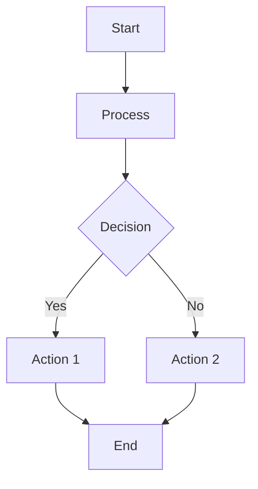

# Workflow Specifications

**Created:** 2025-01-16T12:00:00Z UTC  
**Modified:** 2025-01-16T12:00:00Z UTC

**⚠️ EXAMPLES:** All workflows in this directory are examples. Customize for your project.

Process and workflow specifications for tasks, tickets, bugs, and feature development.

---

## Overview

This directory contains specifications for business processes and workflows.

---

## Workflow Files

### Project Management Workflows
- [GitHub Workflow](./github-workflow.md) - Issue tracking, PRs, branch strategy
- [Task Management](./task-management.md) - Task lifecycle and tracking
- [Issue Tracking](./issue-tracking.md) - Issue types and lifecycle
- [Bug Tracking](./bug-tracking.md) - Bug severity, triage, resolution
- [Feature Development](./feature-development.md) - Feature development stages

### Business Process Workflows
Create additional workflows as needed:

- `user-registration-flow.md` - User registration process
- `order-processing.md` - Order processing workflow
- `approval-workflow.md` - Approval process

---

## Workflow Format

Use Mermaid diagrams for visual workflows:

---

## Workflow Types

### Task & Ticket Workflows
- **Tasks** - General work items and chores
- **Tickets** - Support tickets and requests
- **Issues** - GitHub/issues tracking
- **Bugs** - Bug reports and fixes

### Development Workflows
- **Feature Development** - From spec to deployment
- **Bug Fixing** - Bug triage and resolution
- **Code Review** - Review process
- **Deployment** - Release workflow

### Business Workflows
- **User Registration** - Registration process
- **Order Processing** - Order workflow
- **Approval Processes** - Approval workflows

---

## Related

- **Feature Specs:** `../features/` - Feature specifications
- **Task Management:** `task-management.md` - Task workflow
- **GitHub Workflow:** `github-workflow.md` - GitHub workflow
- **Architecture:** `../../docs/architecture/` - System workflows
- **Conventions:** `../conventions/` - Workflow conventions
- **Specs Index:** `../index.md` - Master index

---

**Note:** Workflow specs define business processes and system flows. All workflows should reference related specifications. Add your workflow specifications here.

