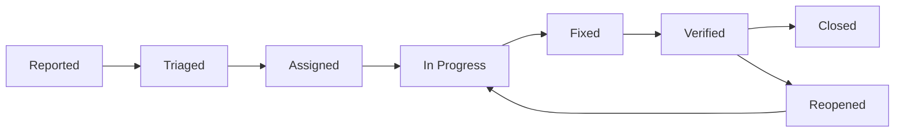

# Bug Tracking Workflow

**Created:** 2025-01-16T12:00:00Z UTC  
**Modified:** 2025-01-16T12:00:00Z UTC

**⚠️ EXAMPLE:** This is an example bug tracking workflow. Customize for your project.

Workflow for tracking, triaging, and resolving bugs.

---

## Bug Severity Levels

### Critical
- System down or unusable
- Data loss or corruption
- Security vulnerability
- Production blocker

### High
- Major functionality broken
- Significant user impact
- Workaround available but difficult
- Affects many users

### Medium
- Minor functionality issue
- Limited user impact
- Workaround available
- Affects some users

### Low
- Cosmetic issue
- Minor inconvenience
- Easy workaround
- Affects few users

---

## Bug Lifecycle

### States

1. **Reported** - Bug reported by user/QA
2. **Triaged** - Bug analyzed and prioritized
3. **Assigned** - Assigned to developer
4. **In Progress** - Being fixed
5. **Fixed** - Fix implemented
6. **Verified** - Fix verified by QA
7. **Closed** - Bug resolved and closed
8. **Reopened** - Bug reappeared

### State Flow



---

## Bug Report Template

```markdown
# Bug: [Short Description]

**Created:** YYYY-MM-DDTHH:MM:SSZ UTC  
**Modified:** YYYY-MM-DDTHH:MM:SSZ UTC

**Status:** Reported | Triaged | Assigned | In Progress | Fixed | Verified | Closed  
**Severity:** Critical | High | Medium | Low  
**Priority:** Critical | High | Medium | Low  
**Assignee:** [Name]  
**Reporter:** [Name]

## Description
Clear description of the bug.

## Steps to Reproduce
1. Step 1
2. Step 2
3. Step 3

## Expected Behavior
What should happen?

## Actual Behavior
What actually happens?

## Environment
- OS: [OS version]
- Browser: [Browser version] (if applicable)
- App Version: [Version]
- Environment: Production | Staging | Development

## Screenshots/Logs
[Attach screenshots or error logs]

## Related Spec
- Feature spec: specs/features/[feature-name].md
- API spec: specs/api/openapi.yaml
- Component: specs/components/[component].yaml

## Workaround
Is there a workaround? Describe it.

## Additional Context
Any other relevant information.
```

---

## Bug Triage Process

### Triage Checklist

- [ ] Bug is reproducible
- [ ] Severity assessed
- [ ] Priority determined
- [ ] Related spec identified
- [ ] Assignee selected
- [ ] Labels applied

### Triage Questions

1. Can we reproduce it?
2. What's the impact?
3. Is there a workaround?
4. Which spec/feature is affected?
5. Who should fix it?

---

## Bug Resolution

### Fix Requirements

- Fix addresses root cause
- Tests added/updated
- Documentation updated if needed
- Related spec updated if behavior changed
- Code review completed

### Resolution Template

```markdown
## Resolution

**Fixed in:** PR #123 / Commit abc123

## Changes Made
- Change 1
- Change 2

## Testing
- [ ] Unit tests added
- [ ] Integration tests added
- [ ] Manual testing completed
- [ ] Regression testing done

## Spec Updates
- Updated: specs/features/[feature].md (if behavior changed)
```

---

## Bug Verification

### Verification Checklist

- [ ] Bug is fixed
- [ ] No regression introduced
- [ ] Tests pass
- [ ] Documentation updated
- [ ] Spec updated if needed

---

## Related

- **Issue Tracking:** `issue-tracking.md` - General issue workflow
- **Task Management:** `task-management.md` - Task workflow
- **Feature Specs:** `../features/` - Feature specifications
- **Testing Standards:** `../conventions/04-testing-standards.md` - Testing conventions
- **Specs Index:** `../index.md` - Master index

---

**Note:** Bugs should always reference the affected feature specification. This ensures proper traceability and helps identify spec updates needed.

