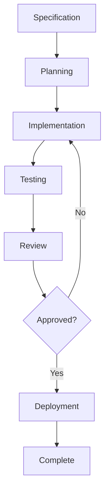

# Feature Development Workflow

**Created:** 2025-01-16T12:00:00Z UTC  
**Modified:** 2025-01-16T12:00:00Z UTC

**⚠️ EXAMPLE:** This is an example feature development workflow. Customize for your project.

Workflow for developing features from specification to completion.

---

## Feature Development Stages

### 1. Specification Phase

**Goal:** Define what to build

- Create feature spec: `specs/features/[feature-name].md`
- Use P.E.C model (Problem, Expectation, Constraint)
- Get stakeholder approval
- Define acceptance criteria

**Deliverables:**
- Feature specification document
- Approved by stakeholders

---

### 2. Planning Phase

**Goal:** Plan how to build it

- Break down into tasks
- Identify dependencies
- Estimate effort
- Assign tasks

**Deliverables:**
- Task breakdown
- Implementation plan
- Timeline estimate

---

### 3. Implementation Phase

**Goal:** Build the feature

- Create branch: `feature/[issue-number]-[feature-name]`
- Implement following spec
- Write code following conventions
- Reference code examples if needed

**Deliverables:**
- Working code
- Follows specification
- Follows conventions

---

### 4. Testing Phase

**Goal:** Verify implementation

- Write tests from acceptance criteria
- Test against spec
- Validate API contracts
- Check constraint compliance

**Deliverables:**
- Unit tests
- Integration tests
- E2E tests (if applicable)
- All tests passing

---

### 5. Review Phase

**Goal:** Code and spec review

- Code review
- Spec compliance check
- API contract validation
- Documentation review

**Deliverables:**
- Code reviewed
- Spec compliance verified
- Documentation updated

---

### 6. Deployment Phase

**Goal:** Deploy to production

- Merge to main branch
- Deploy to staging
- Verify in staging
- Deploy to production
- Monitor

**Deliverables:**
- Feature deployed
- Verified in production
- Monitoring in place

---

## Feature Workflow Diagram

---

## Task Breakdown

### From Feature Spec

Break down feature into tasks:

1. **API Tasks**
   - Create endpoints
   - Update OpenAPI spec
   - Add request/response examples

2. **Data Tasks**
   - Update database schema
   - Create migrations
   - Update models

3. **Business Logic Tasks**
   - Implement services
   - Add validation
   - Handle errors

4. **Testing Tasks**
   - Write unit tests
   - Write integration tests
   - Write E2E tests

5. **Documentation Tasks**
   - Update API docs
   - Update user docs
   - Update ADRs if needed

---

## Related

- **Feature Specs:** `../features/` - Feature specifications
- **Task Management:** `task-management.md` - Task workflow
- **GitHub Workflow:** `github-workflow.md` - GitHub workflow
- **Conventions:** `../conventions/` - Coding conventions
- **Specs Index:** `../index.md` - Master index

---

**Note:** Features should always start with a specification. This workflow ensures features are properly planned and implemented according to specs.

