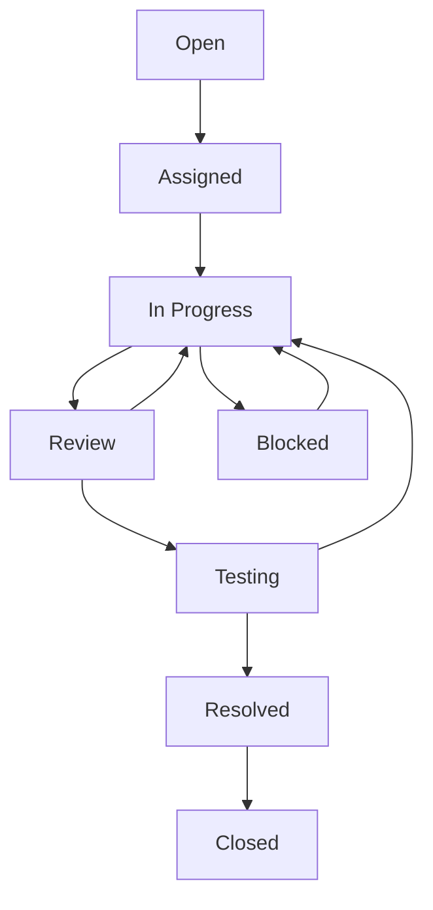

# Issue Tracking Workflow

**Created:** 2025-01-16T12:00:00Z UTC  
**Modified:** 2025-01-16T12:00:00Z UTC

**⚠️ EXAMPLE:** This is an example issue tracking workflow. Customize for your project.

Workflow for tracking issues, bugs, features, and tasks.

---

## Issue Types

### Bug
- Something is broken or not working
- Requires investigation and fix
- Should reference affected feature spec

### Feature
- New functionality request
- Should link to feature specification
- May require new spec creation

### Task
- General work item
- Chore or maintenance
- May or may not require spec

### Enhancement
- Improvement to existing feature
- Should reference existing feature spec
- May require spec update

### Documentation
- Documentation updates
- Should reference affected docs
- May reference feature specs

---

## Issue Lifecycle

### States

1. **Open** - Issue created, not yet assigned
2. **Assigned** - Assigned to developer
3. **In Progress** - Being worked on
4. **Review** - Code/implementation review
5. **Testing** - Testing phase
6. **Resolved** - Fixed/implemented
7. **Closed** - Verified and closed
8. **Blocked** - Waiting on dependencies

### State Transitions



---

## Issue Creation

### From Bug Report

1. Create issue with bug template
2. Link to affected feature spec
3. Set priority and severity
4. Assign to developer

### From Feature Request

1. Create feature specification first
2. Create issue linking to spec
3. Break down into tasks
4. Assign tasks

### From Task

1. Create task issue
2. Link to related spec if applicable
3. Set priority
4. Assign

---

## Issue Linking

### Link to Specs

Always link issues to related specifications:

- **Feature Issues:** Link to `specs/features/[feature-name].md`
- **Bug Issues:** Link to affected feature spec
- **API Issues:** Link to `specs/api/openapi.yaml`
- **Schema Issues:** Link to `specs/schemas/`

### Link Format

```markdown
**Related Spec:** specs/features/user-authentication.md
**Implements:** specs/features/new-feature.md
**Affects:** specs/api/openapi.yaml
```

---

## Priority Levels

### Critical
- Production blocker
- Security vulnerability
- Data loss risk
- Immediate attention required

### High
- Important feature
- Significant bug
- User-facing issue
- Should be done soon

### Medium
- Normal priority
- Standard feature
- Minor bug
- Can wait for next sprint

### Low
- Nice to have
- Minor enhancement
- Documentation
- Can be deferred

---

## Labels and Tags

### Type Labels
- `bug` - Bug report
- `feature` - Feature request
- `task` - Task or chore
- `enhancement` - Enhancement
- `documentation` - Documentation

### Priority Labels
- `priority: critical`
- `priority: high`
- `priority: medium`
- `priority: low`

### Status Labels
- `status: open`
- `status: in-progress`
- `status: blocked`
- `status: review`
- `status: testing`

### Component Labels
- `component: api`
- `component: frontend`
- `component: backend`
- `component: database`

---

## Related

- **Task Management:** `task-management.md` - Task workflow
- **GitHub Workflow:** `github-workflow.md` - GitHub-specific workflow
- **Feature Specs:** `../features/` - Feature specifications
- **Specs Index:** `../index.md` - Master index

---

**Note:** All issues should reference related specifications. This ensures traceability from issue to implementation.

