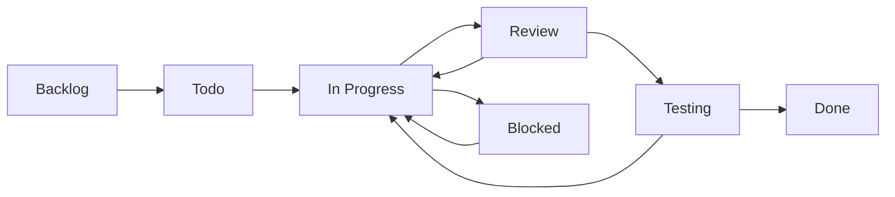

# Task Management Workflow

**Created:** 2025-01-16T12:00:00Z UTC  
**Modified:** 2025-01-16T12:00:00Z UTC

**⚠️ EXAMPLE:** This is an example task management workflow. Customize for your project.

Workflow for managing tasks, tickets, and work items.

---

## Task Types

### Development Tasks
- Feature implementation
- Bug fixes
- Refactoring
- Performance improvements

### Non-Development Tasks
- Documentation updates
- Infrastructure setup
- Configuration changes
- Dependency updates

---

## Task Lifecycle

### States

1. **Backlog** - Task identified, not yet started
2. **Todo** - Ready to start, assigned
3. **In Progress** - Currently being worked on
4. **Review** - Code/implementation review
5. **Testing** - Testing phase
6. **Done** - Completed and verified
7. **Blocked** - Waiting on dependencies

### State Transitions



---

## Task Creation

### From Feature Spec

When creating tasks from a feature specification:

1. Read feature spec: `specs/features/[feature-name].md`
2. Break down into tasks based on:
   - Acceptance criteria
   - Technical design components
   - Dependencies
3. Create task for each component
4. Link tasks to feature spec

### Task Template

```markdown
# Task: [Task Name]

**Created:** YYYY-MM-DDTHH:MM:SSZ UTC  
**Modified:** YYYY-MM-DDTHH:MM:SSZ UTC

**Status:** Backlog | Todo | In Progress | Review | Testing | Done | Blocked  
**Priority:** Critical | High | Medium | Low  
**Assignee:** [Name]  
**Related Feature:** specs/features/[feature-name].md

## Description
What needs to be done?

## Acceptance Criteria
- [ ] Criterion 1
- [ ] Criterion 2

## Technical Details
How will this be implemented?

## Dependencies
- Task #123
- Feature spec: specs/features/[feature].md

## Related
- Issue: #456
- PR: #789
```

---

## Task Tracking

### Tools
- GitHub Issues
- Jira
- Linear
- Asana
- Custom task tracker

### Required Fields
- Title
- Description
- Status
- Priority
- Assignee
- Related spec
- Acceptance criteria

---

## Bug Workflow

### Bug Report Template

```markdown
# Bug: [Short Description]

**Created:** YYYY-MM-DDTHH:MM:SSZ UTC  
**Modified:** YYYY-MM-DDTHH:MM:SSZ UTC

**Status:** Open | In Progress | Fixed | Verified | Closed  
**Severity:** Critical | High | Medium | Low  
**Priority:** Critical | High | Medium | Low

## Description
What is the bug?

## Steps to Reproduce
1. Step 1
2. Step 2
3. Step 3

## Expected Behavior
What should happen?

## Actual Behavior
What actually happens?

## Environment
- OS: [OS version]
- Browser: [Browser version]
- Version: [App version]

## Related Spec
- Feature spec: specs/features/[feature].md
- API spec: specs/api/openapi.yaml
```

### Bug Lifecycle

1. **Reported** - Bug reported
2. **Triaged** - Bug analyzed and prioritized
3. **Assigned** - Assigned to developer
4. **In Progress** - Being fixed
5. **Fixed** - Fix implemented
6. **Verified** - Fix verified by QA
7. **Closed** - Bug resolved

---

## Ticket Workflow

### Ticket Types

- **Feature Request** - New feature
- **Bug Report** - Bug fix
- **Enhancement** - Improvement
- **Task** - General work item
- **Question** - Support question

### Ticket States

- **New** - Just created
- **Open** - Being worked on
- **Pending** - Waiting for information
- **Resolved** - Completed
- **Closed** - Verified and closed

---

## Related

- **Feature Specs:** `../features/` - Feature specifications
- **GitHub Workflow:** `github-workflow.md` - GitHub-specific workflow
- **Conventions:** `../conventions/` - Coding conventions
- **Specs Index:** `../index.md` - Master index

---

**Note:** Tasks, tickets, and bugs should always reference related specifications. This workflow ensures proper tracking and linking.

